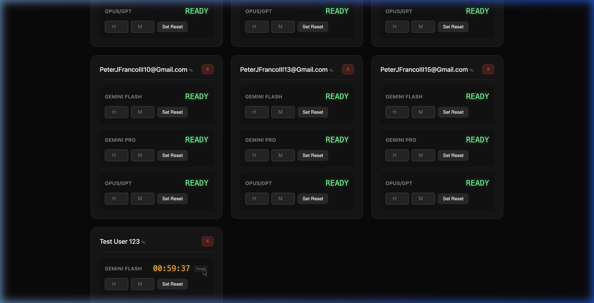

# Antigravity Account Timer

A sleek, desktop-wrapped Django application for tracking model reset timers across multiple accounts.



## Features
- **Account Management**: Add, Rename, and Delete up to 20 accounts.
- **Model Tracking**: Track reset timers for Gemini Flash, Gemini Pro, and Opus/GPT models.
- **Reset Capability**: Quickly reset any active timer back to "READY" if mis-entered.
- **Desktop Experience**: Runs as a standalone macOS application window via `pywebview`.
- **Database**: Backend powered by MongoDB (via Djongo).

## Installation

1.  **Clone the repository**:
    ```bash
    git clone [your-github-repo-url]
    cd "Antigravity Timer"
    ```

2.  **Install dependencies**:
    ```bash
    pip install -r requirements.txt
    ```

3.  **Run the application**:
    ```bash
    python3 launcher.py
    ```

## Technology Stack
- **Backend**: Django & MongoDB
- **GUI Wrapper**: PyWebView (Native macOS Cocoa/WebKit)
- **Frontend**: Vanilla HTML/CSS/JS with glassmorphism aesthetics.

## Contributing
Contributions are welcome! Please see [CONTRIBUTING.md](CONTRIBUTING.md) for guidelines on how to help improve this project.

## License
This project is licensed under the MIT License - see the [LICENSE](LICENSE) file for details.
